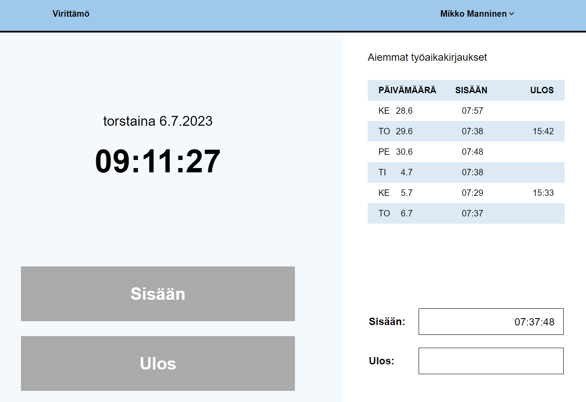
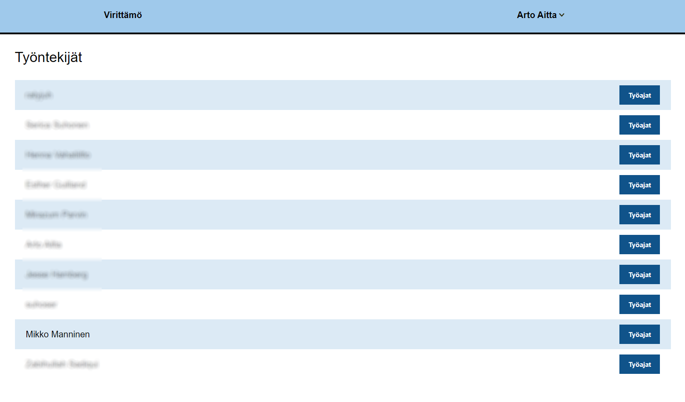
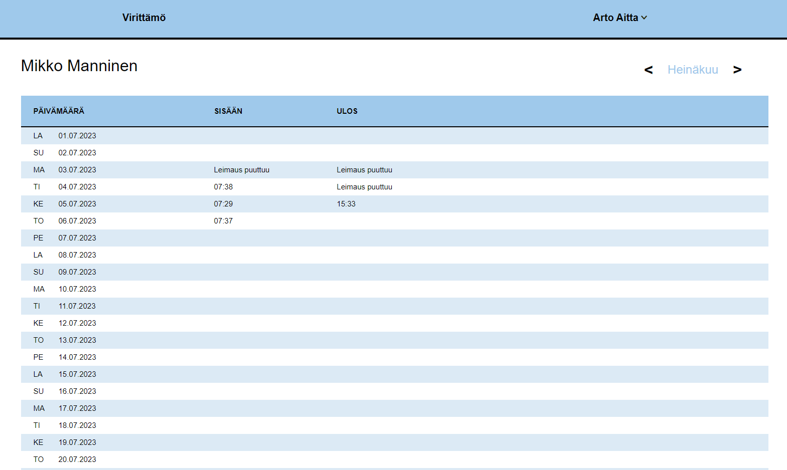

# Tyoaikakirjaus

Työaikakirjaus is a web application for tracking working hours. The front-end code is made with React and the back-end uses Google Firebase services.

The application has two views, one for employees and one for supervisors. In the employee view the employee can make the check in between 7:20 - 9:10. The check out can be made after 8h 04min from check in. The page also shows the working hour data for the previous six days.

The supervisor view shows the list of employees. The supervisor can open employee's work hour data by pressing the button next to the employee's name.

Employee's work hour data is displayed one month at a time on the work schedule page.

Firebase services are protected with the App Check -feature, meaning it only allows database calls from the certain server.

# Authentication
The application is intended for use by Virittämö Helsinki only and the user must log in with the Virittämö Helsinki's email address. The register/sign-in system is made using Google Authentication service.

# How to run the project

1. Clone the project from https://github.com/VirittamoHelsinki/tyoaikakirjaus.git
2. Run "npm install"
3. Copy your own Firebase config settings from your own Firebase project and replace settings in src/firebase/firebase.js file
4. Start the project "npm run dev"
